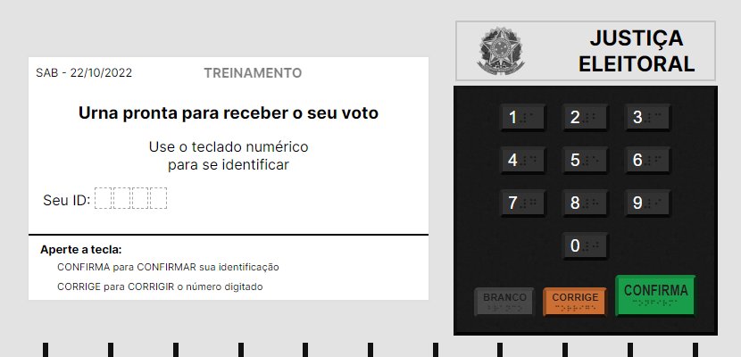

<h1 align="center">Urna Eletrônica - React</h1>

 Projeto front-end onde representa uma urna eletrônica com sistema de votação.

Teste o projeto agora mesmo acessando o [Deploy](https://urna-eletronica-react.vercel.app/)

## Tecnologias Utilizadas:

* Vite
* React.JS
* Typescript
* Sass
* Context API
* LocalStorage
 
 
## Como iniciar?
 
* `yarn install` > instala as dependências
* `yarn dev` > inicia o ambiente de desenvolvimento
* `http://localhost:5173` > URL do projeto hospedado em sua máquina

Modifique os eleitores e os candidatos em `/src/Data/Voters.ts` e `/src/Data/VotingCategories.ts`

## Como votar?

* Espere a urna eletrônica inicializar (3 seg...).
* Digite sua identificação (ex: 1234).
* Digite o número do seu candidato.
* Depois que finalizar os votos digite o número de eleitor "0000" para ver a apuração dos votos.

## Notas:

* O piscar que ocorre na mudança de tela é intencional para ser perceptível a transição entre os estados da tela, podendo ser removido indo ao contexto(`VoteContext.tsx`) e alterando a função `ChangeState()`.

* O carregamento inicial da urna(3seg) é intencional e apenas decorativo, podendo ser removido indo ao contexto(`VoteContext.tsx`) e removendo a função `useEffect()`.

* O Projeto está modelável, isso significa que basta apenas adicionar novas categorias de voto que irá surgir novas telas para determinada categoria, ou remover as existentes...

* Optei pela componentização por hierarquia, na minha opinião fica mais objetivo onde cada componente pertence e mais fácil de saber as dependências de cada um.

* #Pastel2023

---

Adorei essa proposta de codificar uma urna eletrônica, uma ideia simples com uma certa complexidade, dois painéis tendo que se comunicar para no final obter seu voto.

Tentei deixar o mais modelável possível, como por exemplo se quiser adicionar uma categoria a mais, basta apenas adicionar que mais telas surgiram ou novos dados serão mostrados, não sendo necessário alterar o código!

Optei por copiar o mais fiel possível a uma urna eletrônica, tanto nos tamanhos quanto nos detalhes, por exemplo o braile contido nos dígitos realmente está correto, o tamanho dos botões está proporcional, e até os vincos por baixo para abrir a urna optei por colocar.

Decidi que o ID:0 seria o voto nulo e o ID:-1 o voto em branco, então nenhum candidato pode ter estes ID's reservados.